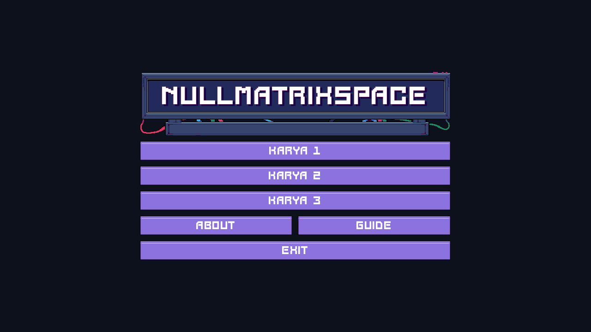
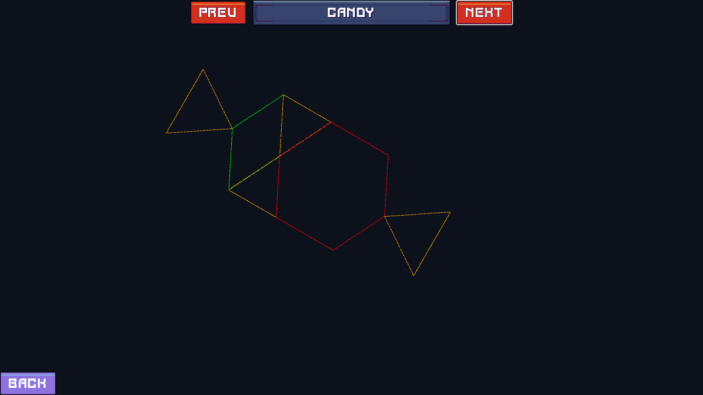
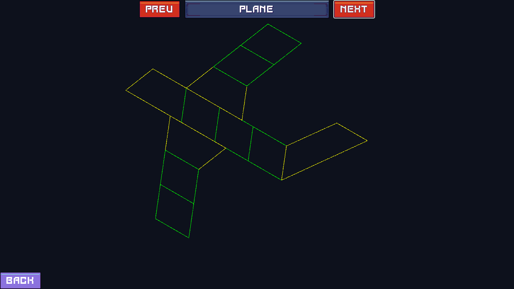

# Proyek Godot Komputer Grafik: Modul 4

Proyek komputer grafik yang dibuat menggunakan [Godot Engine](https://godotengine.org/) dan ditulis dalam bahasa pemrograman C#.

## About Author

- Nama: Ikhsan Satriadi
- NIM: 241511080
- Kelas: 2C
- Prodi: D3 Teknik Informatika

## Karya

### Karya 1: Visualisasi Transformasi Geometri 2D

Deskripsi: Karya ini merupakan visualisasi dari transformasi geometri 2D yang meliputi translasi, rotasi, dan skala. Pengguna dapat memasukkan nilai transformasi melalui slider dan melihat hasilnya secara real-time pada objek 2D di layar.

### Karya 2: Membuat Bunga dengan Transformasi Geometri 2D

Deskripsi: Karya ini menampilkan pembuatan bunga menggunakan transformasi geometri 2D. Setiap kelopak bunga dibuat dengan menerapkan rotasi pada bentuk dasar, menghasilkan pola yang menarik dan simetris.

### Karya 3: Membuat Objek 2D Sederhana

|  |  |
| ----------------------------------------------- | --------------------------------------------------- |
|  |                                                     |

Deskripsi: Karya ini menampilkan pembuatan objek 2D sederhana seperti permen, penguin, dan pesawat terbang. Setiap objek dibuat dengan menggabungkan berbagai bentuk dasar dan menerapkan transformasi geometri.
